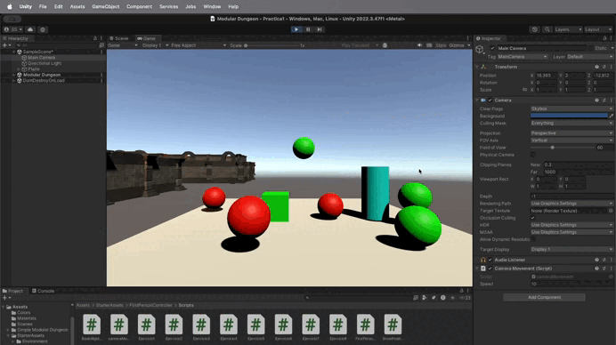
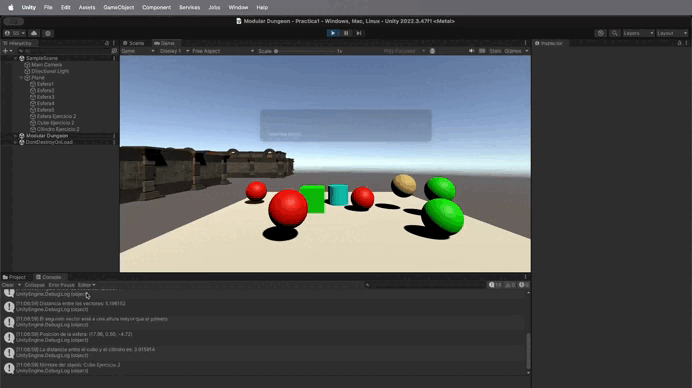

**Video general**

**Video consola**

El concepto de esta práctica se ha basado en aprender a utilizar las diferentes ventajas que nos
dan los scripts en el ámbito de la programación con Unity. Para ello, se han creado 8 scripts 
distintos que nos han enseñado a interactuar con los diferentes elementos de la escena.