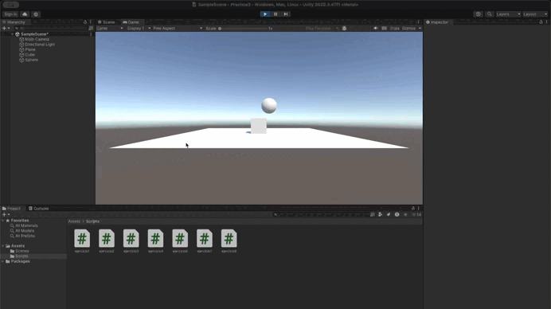

# Práctica 3: Físicas 3D. 
## Autor: Sergio Nicolás Seguí

Para realizar esta práctica he aprendido varias que son utiles en el ámbito de las físicas. Hemos aprendido a crear objetos físicos, a través de rigidbodys, hemos aprendido a crear colisiones, a través de colliders, y hemos aprendido a crear fuerzas, a través de scripts. Además, hemos entendido como funcionan las funcionalidades de isKinematic y trigger.

## Situaciones
### Situación 1:

Aquí yo decidí situar el cubo más arriba para ver como reaccionan los 

### Situación 2:

### Situación 3:

### Situación 4:

### Situación 5:

### Situación 6:

### Situación 7:

### Situación 8:

### Situación 9:

## Ejercicios -> Scripts
## Ejercicio 1:

Al pulsar cada tecla se observa como se muestra en terminal la tecla pulsada y la "presión" que se ejerce sobre ella.

## Ejercicio 2:

Para esto, tuvimos que asignar en Fire1 la tecla "H", y lo que hice fue mostrar en terminal un mensaje para ver que funciona

## Ejercicio 3:

- En el primer caso,el cubo se moverá el doble de rápido en la dirección X. Esto puede resultar en un desplazamiento más pronunciado en esa dirección.
- En el segundo caso, el cubo se moverá más rápido en la misma dirección. Si antes la velocidad era 2, ahora será 4, lo que hará que el cubo recorra más distancia en el mismo tiempo.
- En el caso c, el movimiento será más lento. Por ejemplo, con una velocidad de 0.5, el cubo se moverá la mitad de rápido, haciendo que el desplazamiento sea más gradual.
- En el caso d, si el cubo comienza en una posición con y > 0, seguirá moviéndose en función de la dirección dada por moveDirection. Dependiendo de si el vector tiene un componente en y, el cubo podría moverse también verticalmente.
- En el último caso, el cubo se mueve en relación al sistema de referencia mundia (el cubo se mueve en un eje global)

## Ejercicio 4:

## Ejercicio 5 / 6:

Los pongo juntos porque yo hice el 5 con Time.deltaTime directamente

## Ejercicio 7:

## Ejercicio 8:

## Ejercicio 9:

## Ejercicio 10:

## Ejercicio 11:

## Ejercicio 12:

1. Masa de la esfera 10 veces mayor que el cilindro:
- El cilindro choca contra la esfera y es repelido bruscamente debido a la diferencia de masa. La esfera apenas se mueve, mientras que el cilindro retrocede.
2. Masa de la esfera 10 veces menor que el cilindro:
- En este caso, el cilindro empuja fácilmente la esfera, desplazándola sin dificultad, ya que la diferencia de masa favorece al cilindro.
3. Esfera cinemática:
- La esfera no es afectada por las colisiones físicas ni por la gravedad. El cilindro choca contra ella pero no la mueve; sin embargo, el cilindro se detiene al entrar en contacto con la esfera.
4. Esfera como trigger:
- El cilindro atraviesa la esfera sin interactuar físicamente con ella, ya que los triggers solo detectan la colisión, pero no la resuelven mediante física.
5. Fricción duplicada en el cilindro:
- Al duplicar la fricción, el cilindro se moverá más lentamente al contacto con superficies, y se detendrá más rápido. Si la fricción es muy alta, puede dificultar el control y el deslizamiento del cilindro, especialmente si se usa una configuración de baja velocidad.