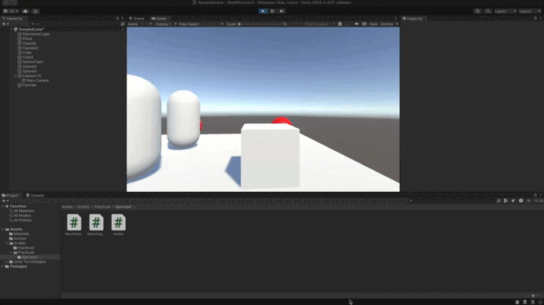
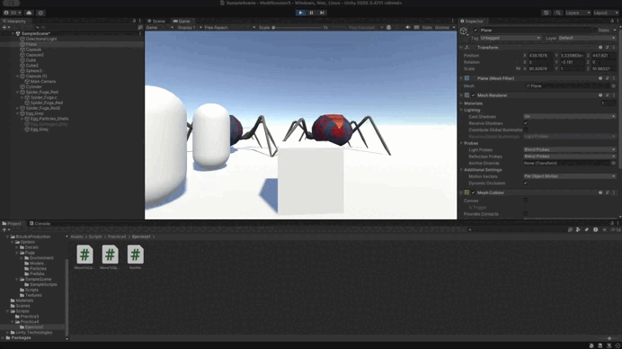
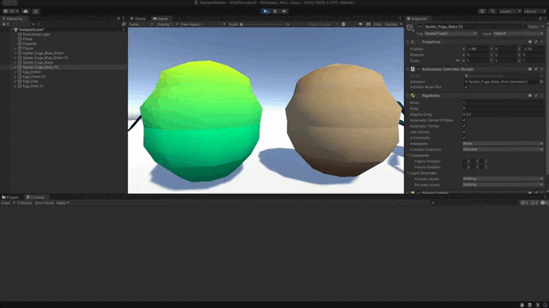
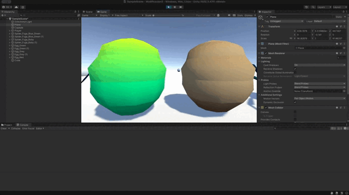
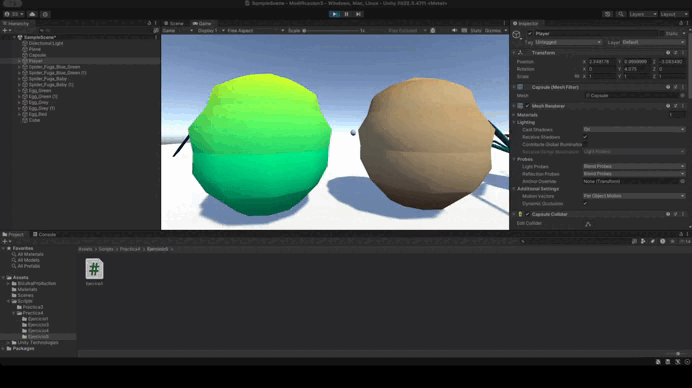
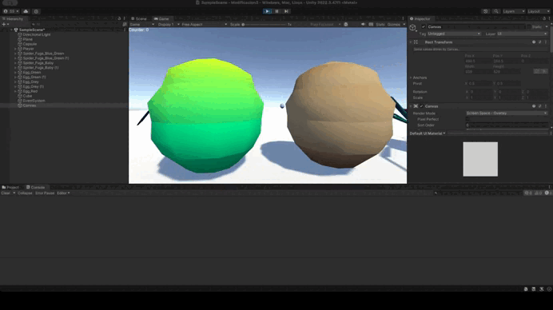
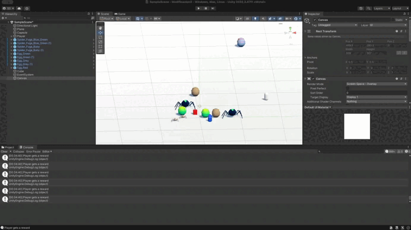

# Práctica 4. Delegados. Eventos. 

Lo que se muestra en este gif es que cuando colisionamos con el cilindro, las esferas de tipo1 se dirigen hacia una de las esferas de tipo2, y las esferas de tipo 2 se desplazan hacia el cilindro.

---

Aquí se muestran las arañas y los huevos.

---

Al final decidí montar una escena nueva para que todo funcionase mejor, porque habían demasiado scripts y cosas que chocaban entre sí. Se observa como al colisionar con el objeto indicado, las arañas se desplazan hacia donde tienen que hacerlo

---

Cuando el cubo se aproxima al objeto de referencia, las arañas del grupo 1 se teletransportan a un huevo objetivo que debes fijar de antemano.Las arañas del grupo 2 se orientan hacia un objeto ubicado en la escena con ese propósito. 

---

Cada vez que se toca el huevo, se incrementa el contador.

---

Aquí se muestra el contador en la UI

---

Al final, cómo yo he ido creando mi escena para ir haciendo los diferentes ejercicios, la escena se me queda así.

---

Al final, como yo ya había hecho el ejercicio 3 como objeto físico, se queda igual.

